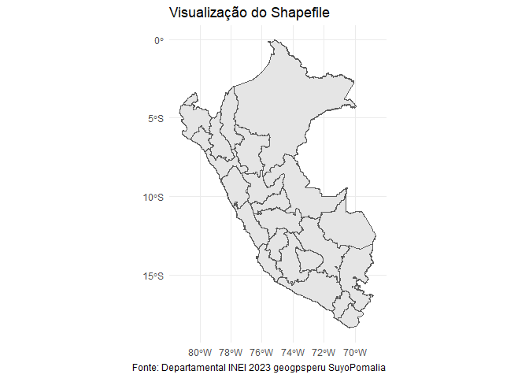
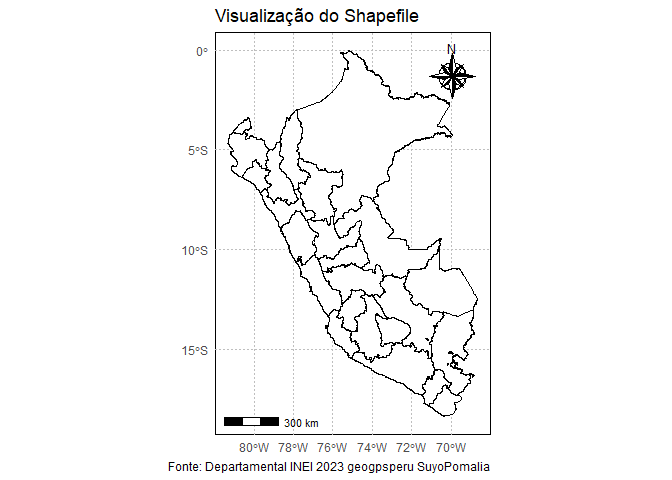

<!-- README.md is generated from README.Rmd. Please edit that file -->

# Climate TRACE - PERU

## Carregando pacotes necessários

``` r
library(sf)
library(tidyverse)
library(ggsci)
# source("R/gafico.R")
# source("R/my-function.R")
```

## Carregando a base de dados

``` r
country_emissions <- read_rds("data/country_emissions.rds")
emissions_sources <- read_rds("data/emissions_sources.rds") 

# emissions_sources$year %>% unique()
# emissions_sources$source_name %>% unique()
# emissions_sources$sector_name %>% unique()
```

## Espacialização dos pontos amostrais

``` r
emissions_sources %>%
  filter(year == 2022) %>%
  ggplot(aes(x=lon,y=lat))+
  geom_point()
```

<!-- -->

``` r
shapefile_path <- "data/Departamental INEI 2023 geogpsperu SuyoPomalia/"
shapefile_data <- st_read(shapefile_path)
#> Reading layer `Departamental INEI 2023 geogpsperu SuyoPomalia' from data source 
#>   `C:\Github\climate-trace-per\data\Departamental INEI 2023 geogpsperu SuyoPomalia' 
#>   using driver `ESRI Shapefile'
#> Simple feature collection with 25 features and 4 fields
#> Geometry type: MULTIPOLYGON
#> Dimension:     XY
#> Bounding box:  xmin: -81.32823 ymin: -18.35093 xmax: -68.65228 ymax: -0.03860597
#> Geodetic CRS:  WGS 84
shapefile_data %>%
  ggplot() +
  geom_sf() +
  theme_minimal() +
  labs(title = "Visualização do Shapefile",
       caption = "Fonte: Departamental INEI 2023 geogpsperu")
```

<!-- -->

``` r
shapefile_data %>%
  ggplot() +
  geom_sf(fill="white", color="black",
          size=.15, show.legend = FALSE) +
  geom_point(
    data = emissions_sources %>%
      filter(year == 2022),
    aes(lon,lat)) +
  theme_minimal()
```

<!-- -->

``` r
nomes_departamentos <- shapefile_data$DEPARTAMEN %>% str_to_title()
nomes_departamentos[17] <- "Madre de Dios"
```

``` r
emissions_sources %>%
  filter(
    year == 2022,
    gas == "co2e_100yr",
    !source_name %in% nomes_departamentos,
    !sub_sector %in% c("forest-land-clearing",
                            "forest-land-degradation",
                            "shrubgrass-fires",
                            "forest-land-fires",
                            "wetland-fires",
                            "removals"),
    sector_name != "forestry_and_land_use"
    # source_name == "Manu"
    ) %>%
  group_by(sector_name) %>%
  summarise(
   emission = sum(emissions_quantity, na.rm=TRUE)
   ) %>%
  arrange(desc(emission)) %>%
  ungroup() %>%
  mutate(
    Acumulada = cumsum(emission)
  )
#> # A tibble: 7 × 3
#>   sector_name             emission Acumulada
#>   <chr>                      <dbl>     <dbl>
#> 1 agriculture            25303626. 25303626.
#> 2 transportation         14855209. 40158835.
#> 3 power                  14185000  54343835.
#> 4 mineral_extraction      7464696  61808531.
#> 5 manufacturing           7104411  68912942.
#> 6 waste                   6930570. 75843512.
#> 7 fossil_fuel_operations  6262046. 82105558.
```
